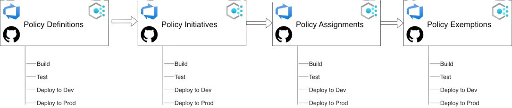
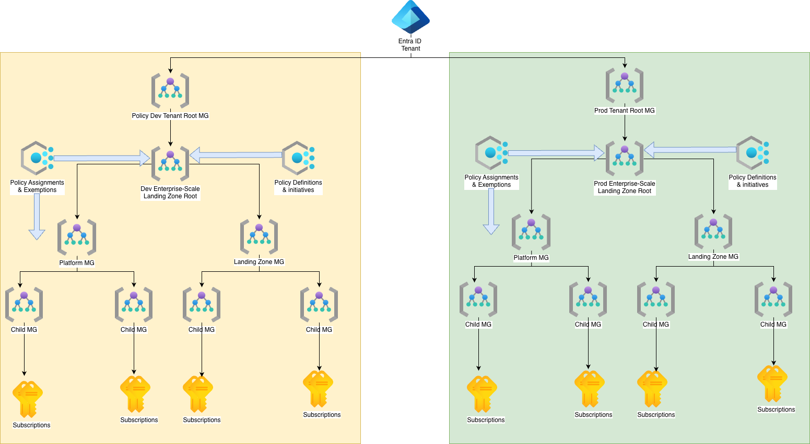
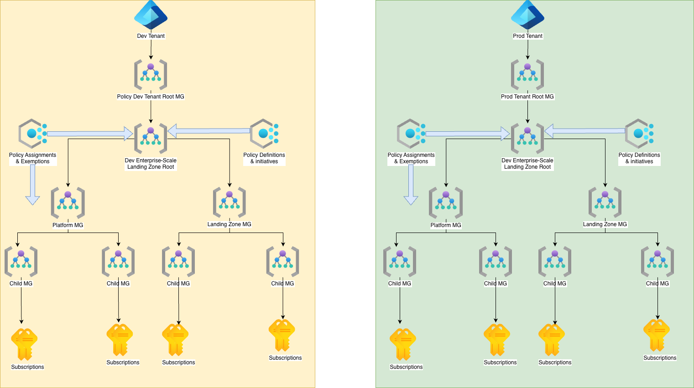

# AzPolicyFactory

**AzPolicyFactory** — Infrastructure as Code (IaC) solutions for Azure Policy resources.

## Introduction

It can be challenging to manage Azure Policy resources at scale, especially in large organizations with complex governance requirements.

AzPolicyFactory provides a comprehensive set of IaC solutions for testing, deploying and managing Azure Policy resources at scale.

By leveraging these IaC templates and pipelines, organizations can automate the deployment and management of Azure Policy resources, ensuring consistent governance across their Azure environments while reducing manual effort and the risk of misconfigurations.

This repository contains the complete set of IaC solutions for deploying Azure Policy resources, including:

- Bicep Modules for Azure Policy and supporting resources
- Bicep templates for deploying the following Azure Policy resources:
  - Policy Definitions
  - Policy Initiatives
  - Policy Assignments
  - Policy Exemptions
- Azure DevOps pipelines and GitHub Action workflows for:
  - Deploying Azure Policy Definitions, Initiatives, Assignments, and Exemptions
  - PR Validation Code Scan using GitHub Super-Linter
  - PR Validation for Azure Policy Assignment configurations between production and development environments

The solution automates the entire lifecycle of Azure Policy resources — from code commit through testing and validation to production deployment — ensuring quality and correctness at every stage.

## Feature Highlights

The Azure Policy IaC solution in this repository includes the following key features:

- Supports both Azure DevOps pipelines and GitHub Actions workflows for maximum flexibility and compatibility with different CI/CD platforms.
- Comprehensive set of Bicep modules and templates for deploying Azure Policy resources, following best practices for modularity, reusability, and maintainability.
- Comprehensive set of tests and validation at different stages of the CI/CD pipelines to ensure the quality and correctness of the Azure Policy resources being deployed.
- Follows industry best practices for Azure Policy management, safe deployment, code scan, and PR validation to ensure that the Azure Policy resources are deployed in a secure and compliant manner.
- Unit tests for every policy resource being deployed.
- Policy Integration Test (coming soon) to validate the functionality and effectiveness of the deployed Azure Policy resources in enforcing the desired governance and compliance requirements.

## Recommended Architectural Approach for Azure Policy IaC

A key element for any successful IaC implementation is to have a dedicated dev/test environment that mimics the production environment as closely as possible. This is especially important for Azure Policy resources because they have a direct impact on the governance and compliance of the Azure environment.

We recommend the following architectural approach for implementing Azure Policy IaC:

### Single Tenant

Many organizations have a single Microsoft Entra ID tenant, and they manage multiple Azure subscriptions under that tenant. In this case, we recommend separate Management Group hierarchies for production and development environments.

### Multiple Tenants

Some organizations have multiple Microsoft Entra ID tenants for different environments (e.g., production, development, testing). In this case, we recommend identical Management Group hierarchies for production and development tenants for the Azure Policy IaC implementation.

>:exclamation: **Important Note**: The design decision for dedicated **POLICY** development management group hierarchy is explained in the FAQ [What is the purpose of dedicated development management group hierarchy in the recommended architecture for Azure Policy IaC implementation?](./docs/FAQ.md#what-is-the-purpose-of-dedicated-development-management-group-hierarchy-in-the-recommended-architecture-for-azure-policy-iac-implementation)

## Get Started

Refer to the [**Documentation**](docs/README.md) for setup guides and detailed information on the repository structure, CI/CD pipelines, configurations, and included Azure Policy resources.

The documentation provides a comprehensive overview of how to use the AzPolicyFactory solutions in this repository to manage Azure Policy resources effectively.
