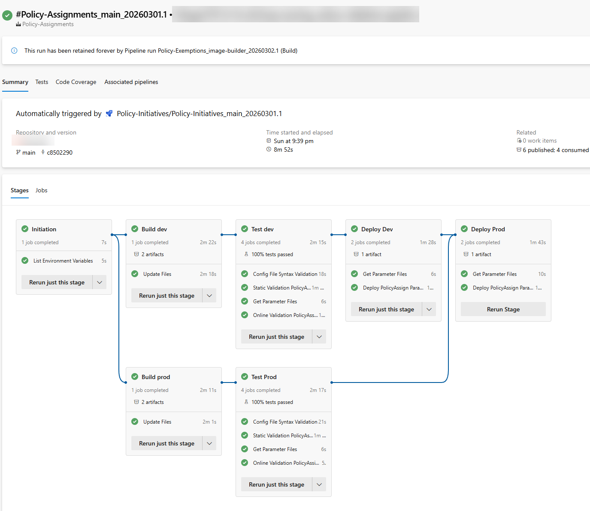
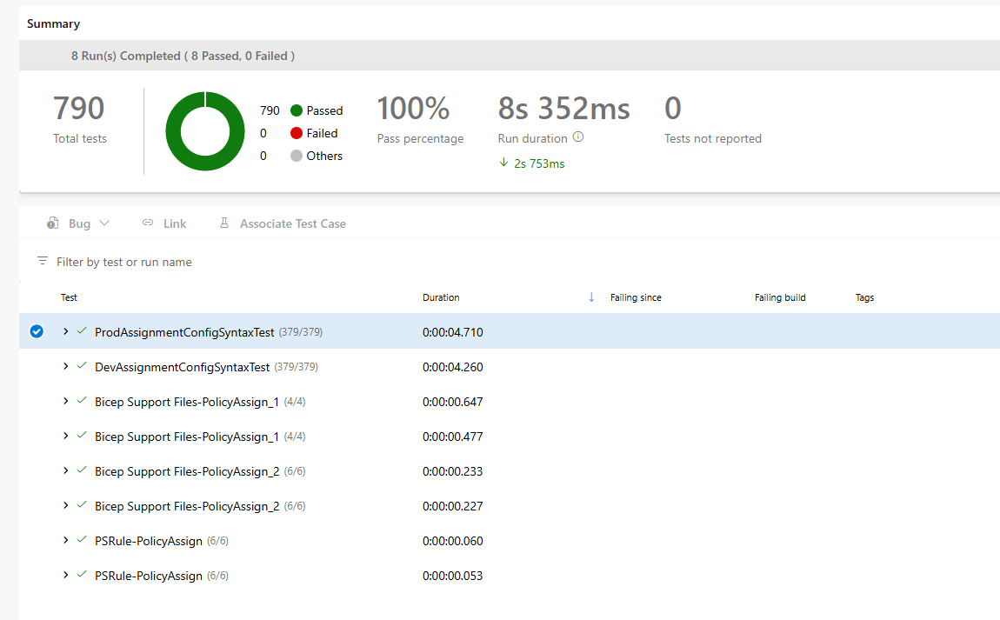

# Azure DevOps Pipelines for Azure Policy Assignments

## Overview

The [Policy Assignments Azure DevOps Pipeline](../../.azuredevops/pipelines/policies/azure-pipelines-policy-assignments.yml) deploys all required policy assignments to the target Azure environments.

The pipeline consists of the following stages:

- Initiation
- Build Dev
- Build Prod
- Test Dev
- Test Prod
- Deploy Dev
- Deploy Prod

1. After the `Initiation` stage, the `Build Dev` and `Build Prod` stages are kicked off concurrently. These stages are responsible for building the policy assignment Bicep template for the development and production environments respectively.
2. The `Test Dev` and `Test Prod` stages are responsible for performing additional tests in their respective environments. They are kicked off after the `Build Dev` and `Build Prod` stages respectively.
3. The `Deploy Dev` stage is kicked off upon successful completion of the `Test Dev` stage. It is responsible for deploying the policy assignments to the development environment.
4. The `Deploy Prod` stage will only be kicked off when all the following conditions are met:
    - The `Deploy Dev` stage has completed successfully.
    - The `Test Prod` stage has completed successfully.
    - The pipeline is triggered from the `main` branch or a git tag.

## 2. Pipeline Trigger

The Policy Assignments pipeline is designed to be triggered by the following methods:

- Manually
- Upon the successful completion of the [Policy Initiatives pipeline](../../.azuredevops/pipelines/policies/azure-pipelines-policy-initiatives.yml) when the `Deploy Prod` stage is completed and the pipeline is triggered from the `main` branch.

## 3. Stages

### 3.1 Initiation

This stage is the entry point of the pipeline. It uses the pipeline template [template-stage-initiation.yml](../../.azuredevops/templates/template-stage-initiation.yml). It simply displays the current UTC time and environment variables on the agent for debugging purposes.

### 3.2 Build Dev and Build Prod

These stages use the pipeline template [template-stage-policy-assignment-exemption-build.yml](../../.azuredevops/templates/template-stage-policy-assignment-exemption-build.yml) to populate the paths of each policy assignment configuration file and add them to the Policy assignment Bicep template file.

These JSON files will then get loaded at compile time by the Policy Assignment bicep module using the `LoadJsonContent()` Bicep function.

The updated Bicep template file is then stored as build artifacts.

### 3.3 Test Dev and Test Prod

These stages use the following pipeline templates to perform a set of tests on the Bicep templates generated in the `Build Dev` and `Build Prod` stages respectively:

- [template-job-policy-assignment-exemption-config-syntax-validate.yml](../../.azuredevops/pipelines/templates/template-job-policy-assignment-exemption-config-syntax-validate.yml)
- [template-job-test-and-validate.yml](../../.azuredevops/pipelines/templates/template-job-test-and-validate.yml)

The tests include:

- Policy Assignment Configuration Syntax tests ([PolicyAssignmentConfigTests.ps1](../../tests/policyAssignment/configuration-syntax/assignmentConfigurationsSyntaxTest.ps1))
- Bicep Support File tests ([BicepRequiredSupportFilesTests.ps1](../../tests/bicep/BicepRequiredSupportFilesTests.ps1))
- Bicep Linter tests by calling the `bicep build` command.
- PSRule tests
- Template deployment validation tests

The test results are then published in the pipeline run.

The results can be viewed in the `Tests` tab of the pipeline run.

>**NOTE:** At the time of writing this document, the PSRule for Azure module does not provide any tests for policy resources. Also the ARM What-If validation does not work with policy resources (This issue has been reported on What-If's issue tracker on [GitHub](https://github.com/Azure/arm-template-whatif/issues/355)).

### 3.4 Deploy Dev

This stage uses the pipeline template [template-stage-multiple-deployments.yml](../../.azuredevops/pipelines/templates/template-stage-multiple-deployments.yml).

It deploys the policy assignments Bicep template generated from the `Build Dev` stage upon successful completion of the `Test Dev` stage.

The policy assignments Bicep template does not require any parameter files.

Although only a single deployment job is created to deploy all the policy assignments, the bicep templates are designed to create them concurrently (with up to 15 concurrent resource deployment defined in Bicep).

### 3.5 Deploy Prod

Same as the `Deploy Dev` stage, this stage uses the pipeline template [template-stage-multiple-deployments.yml](../../.azuredevops/templates/template-stage-multiple-deployments.yml).

It deploys the policy assignments Bicep template generated from the `Build Prod` stage upon successful completion of the `Test Prod` and `Deploy Dev` stages.

The condition for this stage also dictates that the pipeline must be triggered from the `main` branch for this stage to start.
