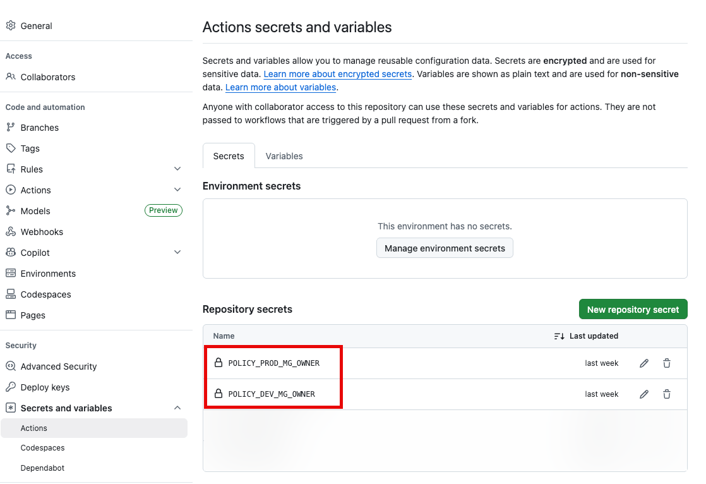

# Setup Guide for GitHub Actions Workflows

This document provides a step-by-step guide to set up the GitHub Actions workflows for deploying Azure Policy resources using the AzPolicyFactory solution.

Before you begin, make sure you have the necessary pre-requisites in place as outlined in the [Pre-requisites](pre-requisites.md) document.

## Step 1: Create GitHub Secrets for Azure authentication

The GitHub Actions workflows use the [`Azure Login Action`](https://github.com/marketplace/actions/azure-login) to authenticate with Azure. You need to create an action secret for each environment (development and production) in your GitHub repository to store the credentials for the Azure service principal that will be used for authentication.

The identity used by the service connection needs to have the `Owner` role assigned at the top Enterprise Scale Landing Zone (ESLZ) management group.

You must name the secrets exactly as follows for the workflows to work correctly:

| Environment | Secret Name |
| :---------- | :---------- |
| Development | `POLICY_DEV_MG_OWNER` |
| Production  | `POLICY_PROD_MG_OWNER` |



The workflows use the [`cred`](https://github.com/marketplace/actions/azure-login#creds) input of the Azure Login Action, which requires a JSON object containing the following properties:

```json
{
    "clientSecret":  "******",
    "subscriptionId":  "******",
    "tenantId":  "******",
    "clientId":  "******"
}
```

>:memo: NOTE: The `subscriptionId` property is not used for authentication in this scenario because we are authenticating at the management group scope level, but it is still a required property for the `cred` input of the Azure Login Action. You can use any valid subscription ID that belongs to management group hierarchy of the top-level management group where the policies will be deployed.

You should configure separate secrets for development and production environments using different identities.

## Step 2: Configure Workflow Variables

Update the following variable values in the [settings.yml](../../settings.yml) file to match your environment and service connection names:

| Variable Name | Description | Example Value |
| :------------ | :---------- | :------------ |
| `default-region` | The default Azure region to use for Azure resource deployment. | `australiaeast` |
| `prodManagementGroup` | The name of the top-level production management group where the policies will be deployed. | `CONTOSO` |
| `devManagementGroup` | The name of the top-level development management group where the policies will be deployed. | `CONTOSO-DEV` |
| `prodEnv` | The name of the production environment. | `prod` |
| `devEnv` | The name of the development environment. | `dev` |
| `whatIfValidationMaxRetrys` | The maximum number of retries for the What-If validation step in the pipeline. (3-10) | `4` |

>:memo: NOTE: Unlike the ADO pipelines, the workflow runner pool is not defined as a variable in the settings file. All the workflows are configured to use the `ubuntu-latest` GitHub-hosted runner pool. If you want to use a different runner pool, you will need to update the `runs-on` property in each workflow YAML file accordingly.

## Step 3: Add Policy Resources to the repository

Follow the instructions in the [Add Policy Resources](add-policy-resources.md) document to add the following resources to the repository:

- Custom Azure Policy definitions in the `./policyDefinitions` folder
- Custom Azure Policy initiatives in the `./policyInitiatives` folder
- Policy assignment configuration files in the `./policyAssignments` folder
- Policy exemption configuration files in the `./policyExemptions` folder

## Step 4: Configure Branch Ruleset (Optional)

To ensure that changes to the workflow YAML files and policy resources are reviewed and approved before being merged into the main branch, it is recommended to configure a branch ruleset for the main branch in your GitHub repository as per your organization's governance requirements.

We recommend at least the following configurations are in place for the main branch:

- Require a pull request before merging
  - Configure number of required approvals
  - Limit merge method to only allow `Squash merge` to maintain a clean commit history

## Step 5: Temporarily Disable the `Deploy Prod` jobs in the workflow YAML files (Recommended)

Since GitHub won't recognize the new workflows until they are merged into the main branch, we recommend that you temporarily disable the `Deploy Prod` jobs in the workflow YAML files by adding `if: false` condition to the job definition.

This will allow you to create and merge the workflows into the main branch without triggering any deployments to production environment until you are ready to enable them.

You can temporarily disable the `Deploy Prod` jobs by updating the job condition in each workflow YAML file:

Change from:

```yaml
  job_deploy_prod:
    name: "Deploy Prod"
    if: github.ref == 'refs/heads/main'
```

to

```yaml
  job_deploy_prod:
    name: "Deploy Prod"
    if: false
```

You can change it back to the original condition by creating a PR to update the workflow YAML files once you are ready to enable the production deployment jobs.

## Step 6: Assessing PR Validation workflows for the main branch (Optional but Recommended)

To ensure that any changes to the policy resources are validated before being merged into the main branch, we have included 2 workflows that are configured to run when a pull request (PR) is created or updated. It is recommended to set up these PR validation workflows in the branch protection policy for the `main` branch.

These workflows are:

### PR Policy Assignment Environment Consistency Tests

This workflow validates and compares the values in each production policy assignment configuration file against the corresponding development environment configuration file to ensure consistency between the two environments.

This is to ensure any value deviations between the two environments are intentional and reviewed before being merged into the main branch.

>:exclamation: **IMPORTANT**: Follow the instructions in the [Policy Assignment Environment Consistency Tests](../assignment-environment-consistency-tests.md) to understand and customize the tests performed by this workflow.

The workflow will fail if any differences are detected between the production and development configuration files.

This workflow is configured to run on pull requests targeting the `main` branch, with the following path filter:

```yaml
  paths:
    - "policyAssignments/**"
    - "tests/policyAssignment/environment-consistency/**"
    - ".github/workflows/pr-policy-assignment-env-consistency.yml"
    - ".github/actions/templates/test-policy-assignment-env-consistency/**"
```

You may need to update the path filter in the workflow YAML file if you have made any changes to the folder structure or filenames for the policy assignment configuration files or the related tests.

### PR Code Scan

This workflow performs a code scan using GitHub Super-Linter to validate all the files in the repository with a wide range of different linters and rulesets to ensure code quality and consistency.

>:memo: NOTE: You can customize the linters and rulesets used by GitHub Super-Linter by modifying the configuration file of each linter in the `.github/linters` folder. For details on how to customize the GitHub Super-Linter, please refer to the [official project site](https://github.com/super-linter/super-linter).

## Step 7: Merge changes to the main branch and test run the workflows

Create a PR to merge your changes into the `main` branch.

After the PR is approved and merged, manually trigger the workflows in the following order:

- `policy-definitions`
- `policy-initiatives`
- `policy-assignments`
- `policy-exemptions`

Since you have added the `if: false` condition to the `Deploy Prod` jobs in the workflow YAML files, the production deployment jobs will be skipped during this initial run. You can then create a PR to update the workflow YAML files to change the condition back to `if: github.ref == 'refs/heads/main'` to enable the production deployment jobs for future runs.

:memo: NOTE: The workflows are not daisy-chained together until you have changed the condition for the `Deploy Prod` jobs back to `if: github.ref == 'refs/heads/main'`.
